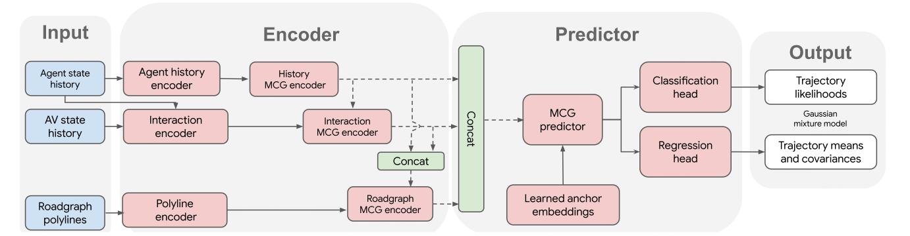

# MULTIPATH++: EFFICIENT INFORMATION FUSION AND TRAJECTORY AGGREGATION FOR BEHAVIOR PREDICTION  

1. 摘要  
multi path++需要road的polylines和agent的状态信息（位置、速度、加速度）作为输入。  
2. 引言  
- multipath框架通过使用高斯混合模型（GMM）解决了多模态输出空间的挑战。
- 本文做出的改进：  
1）不再使用CNN提取物体的特征，使用polylines表示road，RNNs表示具有历史信息的agent。  
2）获得road和agent的关系至关重要，为了解决这一问题，本文提出上下文encoding形式multi-context gating (MCG)，mcg使用gnn实现。  
3）优化了轨迹建模的方式，学习锚点的潜在表示方法，由于multipath的原始静态锚点。  

3. 相关工作  
- raster方法有明显缺点：难以对距离较远的对象建模，视野受限并且难以表示连续的物理状态。  

4. 模型架构  
  
- mcg  
提出有效的融合机制，使用mcg方式。  
- 编码器  
编码器包含：agent历史编码、agent交互编码、road网络编码。  
- 输出表示  
multipath++预测GMM的未来行为分布，分布在时间步长上是有条件独立的，每个时间步长上的每个模式都表示为(x,y)上的高斯分布。  